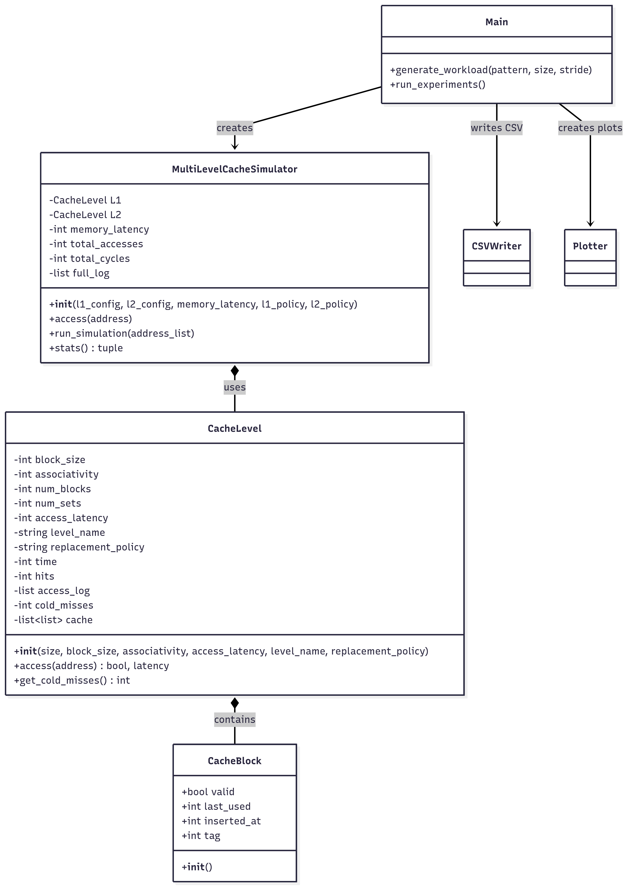

<h1 align="center">Two-Level Cache Simulator</h1>

<p align="center">
  <b>Analyze, visualize, and understand cache memory performance with a flexible, extensible Python simulator.</b>
</p>

---

## Project Overview

This project implements a **detailed simulator for a two-level cache memory system (L1 and L2)**, allowing users to investigate and visualize the performance benefits of cache memory in reducing access times for data and instructions. The simulator is highly configurable, supports multiple replacement policies, and provides both summary and per-access visualizations.

---

## Features

- **Configurable Cache Hierarchy**
  - Simulates both L1 and L2 caches.
  - User-configurable parameters: cache size, block size, associativity, and access latency for each level.
  - Supports two replacement policies: **LRU (Least Recently Used)** and **FIFO (First-In, First-Out)**.

- **Flexible Workload Generation**
  - Generates memory access patterns to mimic real-world scenarios:
    - **Sequential:** Linear address progression.
    - **Looping:** Repeated access to a small address window (mimics loops in code).
    - **Random:** Randomized address accesses.

- **Detailed Simulation Engine**
  - Each memory access is simulated through L1 and L2 caches, with fallback to main memory on misses.
  - Tracks hits, misses, cold misses, and total cycles for each cache level.
  - On L2 or memory miss, blocks are loaded into the appropriate cache(s) according to the replacement policy.

- **Comprehensive Experimentation**
  - Automatically runs experiments across all combinations of:
    - Cache sizes (e.g., 64B, 128B)
    - Associativities (e.g., direct-mapped, 2-way, 4-way)
    - Block sizes (e.g., 4B, 8B)
    - Workload patterns
    - Replacement policies
  - For each experiment, collects and stores:
    - L1 and L2 hit rates
    - Average Memory Access Time (AMAT)
    - Number of cold misses
    - All per-access results (address, hit/miss, level, latency)

- **Results Output and Visualization**
  - **CSV Export:** All experiment results are saved to `cache_performance_comparison.csv` for further analysis.
  - **AMAT Plot:** Generates a summary plot of AMAT vs. block size for all workloads and policies, with a textual summary embedded in the plot.
  - **Per-Access Visualization:** For the first experiment, creates a scatter plot showing the outcome (hit/miss and level) of every single memory access, helping users visually understand cache behavior over time.
  - **Console Summary:** Prints a detailed summary of average, minimum, and maximum AMAT for each workload and policy.

- **Extensible and Readable Codebase**
  - Modular class design for cache blocks, cache levels, and the multi-level simulator.
  - Easy to extend with new policies, cache levels, or workload patterns.
  - Well-commented and structured for educational use.

---

## Output Artifacts

- `cache_performance_comparison.csv` — Tabular summary of all experiments.
- `amat_comparison_with_summary.png` — AMAT vs. block size plot with summary.
- Per-experiment access logs (CSV) — Detailed logs of every memory access for in-depth analysis.

---
## Architecture Flowchart

The following flowchart illustrates the high-level architecture and class relationships within the Two-Level Cache Simulator. It shows how the main components—such as the cache levels, blocks, and simulation engine—interact to process memory accesses and collect performance statistics.

<p align="center">
  
</p>

*Figure: Class diagram and flow of the cache simulation system.*


---


---

## How It Works

1. **Define Cache and Simulator Classes:**  
   Models cache blocks, sets, and levels, and manages simulation of memory accesses.

2. **Generate Workloads:**  
   Creates address sequences based on selected patterns.

3. **Run Experiments:**  
   Iterates over all parameter combinations, simulates memory accesses, and collects statistics.

4. **Save and Visualize Results:**  
   Outputs results to CSV, generates summary and per-access plots, and prints a textual summary.

---

## Installation

1. **Clone the repository:**

   - Using command line:
    ```bash
    git clone https://github.com/AcePenaflorida/multi-level-cache-simulator.git
    ```

   - Using **GitHub Desktop**:
     1. Open GitHub Desktop.
     2. Click **File** > **Clone repository**.
     3. Select the **URL** tab.
     4. Paste the URL:  
        `https://github.com/AcePenaflorida/multi-level-cache-simulator.git`
     5. Choose your local path and click **Clone**.

   - Using **VS Code**:
     1. Open VS Code.
     2. Press `Ctrl+Shift+P` (or `Cmd+Shift+P` on Mac) to open the Command Palette.
     3. Type **Git: Clone** and select it.
     4. Paste the URL:  
        `https://github.com/AcePenaflorida/multi-level-cache-simulator.git`
     5. Choose your local folder and wait for the clone to finish.
     6. Open the cloned folder in VS Code.

2. Navigate into the project directory (if using terminal):
    ```bash
    cd Multi-Level-Cache-Simulator
    ```

3. Create and activate a virtual environment (terminal):
    ```bash
    python -m venv venv
    .\venv\Scripts\activate   # Windows
    # OR for Mac/Linux
    source venv/bin/activate
    ```

4. Install dependencies:
    ```bash
    pip install -r requirements.txt
    ```

---

## Example Use Cases

- **Educational Demonstrations:**  
  Visualize and explain how cache parameters and policies affect performance for different memory access patterns.

- **Research and Analysis:**  
  Rapidly prototype and compare cache configurations for custom workloads.

- **Performance Tuning:**  
  Explore the impact of associativity, block size, and replacement policy on cache efficiency and AMAT.

---

<p align="center">
  
  
</p>

<p align="center">
  <i>This project is ideal for anyone seeking to understand, teach, or analyze the inner workings and performance trade-offs of cache memory systems.</i>
</p>
