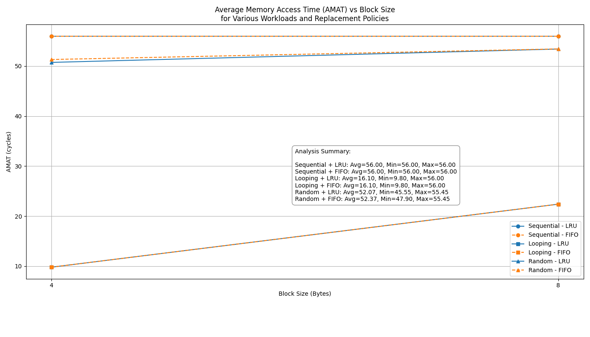

name: Cache Simulator CI/CD

on:
  push:
    branches: [ main, develop ]
  pull_request:
    branches: [ main ]
  workflow_dispatch:  # Allows manual triggering

jobs:
  test-and-analyze:
    runs-on: ubuntu-latest
    strategy:
      matrix:
        python-version: [3.8, 3.9, '3.10', '3.11']
    
    steps:
    - name: 📥 Checkout Repository
      uses: actions/checkout@v4
    
    - name: 🐍 Set up Python ${{ matrix.python-version }}
      uses: actions/setup-python@v4
      with:
        python-version: ${{ matrix.python-version }}
    
    - name: 📦 Cache dependencies
      uses: actions/cache@v3
      with:
        path: ~/.cache/pip
        key: ${{ runner.os }}-pip-${{ hashFiles('**/requirements.txt') }}
        restore-keys: |
          ${{ runner.os }}-pip-
    
    - name: 🔧 Install dependencies
      run: |
        python -m pip install --upgrade pip
        pip install matplotlib pandas pytest flake8 black isort bandit
        if [ -f requirements.txt ]; then pip install -r requirements.txt; fi
    
    - name: 🎨 Check code formatting (Black)
      run: |
        black --check --diff .
      continue-on-error: true
    
    - name: 📋 Check import sorting (isort)
      run: |
        isort --check-only --diff .
      continue-on-error: true
    
    - name: 🔍 Lint with flake8
      run: |
        # Stop the build if there are Python syntax errors or undefined names
        flake8 . --count --select=E9,F63,F7,F82 --show-source --statistics
        # Exit-zero treats all errors as warnings. Line length set to 88 (Black's default)
        flake8 . --count --exit-zero --max-complexity=10 --max-line-length=88 --statistics
    
    - name: 🔒 Security check with bandit
      run: |
        bandit -r . -f json -o bandit-report.json
      continue-on-error: true
    
    - name: 🧪 Run Cache Simulation
      run: |
        python main.py
    
    - name: 📊 Verify output files
      run: |
        ls -la *.csv *.png
        echo "Checking if required files were generated..."
        test -f cache_performance_comparison.csv
        test -f amat_comparison_with_summary.png
        echo "✅ All required files generated successfully!"
    
    - name: 📈 Upload simulation results
      uses: actions/upload-artifact@v3
      if: always()
      with:
        name: simulation-results-python-${{ matrix.python-version }}
        path: |
          *.csv
          *.png
          bandit-report.json
        retention-days: 30
    
    - name: 📋 Upload simulation summary
      uses: actions/upload-artifact@v3
      if: always()
      with:
        name: simulation-logs-python-${{ matrix.python-version }}
        path: |
          access_log_*.csv
        retention-days: 7

  performance-analysis:
    needs: test-and-analyze
    runs-on: ubuntu-latest
    if: github.ref == 'refs/heads/main'
    
    steps:
    - name: 📥 Checkout Repository
      uses: actions/checkout@v4
    
    - name: 🐍 Set up Python
      uses: actions/setup-python@v4
      with:
        python-version: '3.10'
    
    - name: 📦 Install dependencies
      run: |
        python -m pip install --upgrade pip
        pip install matplotlib pandas numpy seaborn
    
    - name: 📊 Run extended performance analysis
      run: |
        python main.py
        echo "Performance analysis completed"
    
    - name: 📈 Generate performance report
      run: |
        python -c "
import pandas as pd
import matplotlib.pyplot as plt

# Read results
df = pd.read_csv('cache_performance_comparison.csv')

# Generate summary statistics
summary = df.groupby(['Workload', 'Policy'])['AMAT'].agg(['mean', 'min', 'max', 'std']).round(2)
print('=== PERFORMANCE SUMMARY ===')
print(summary)

# Save summary to file
with open('performance_summary.txt', 'w') as f:
    f.write('Cache Simulator Performance Summary\n')
    f.write('=====================================\n\n')
    f.write(str(summary))
        "
    
    - name: 📤 Upload performance analysis
      uses: actions/upload-artifact@v3
      with:
        name: performance-analysis
        path: |
          performance_summary.txt
          *.csv
          *.png

  deploy-docs:
    needs: [test-and-analyze, performance-analysis]
    runs-on: ubuntu-latest
    if: github.ref == 'refs/heads/main'
    
    steps:
    - name: 📥 Checkout Repository
      uses: actions/checkout@v4
    
    - name: 📥 Download artifacts
      uses: actions/download-artifact@v3
      with:
        name: performance-analysis
        path: ./docs
    
    - name: 📝 Create documentation page
      run: |
        mkdir -p docs
        cat > docs/index.html << 'EOF'
        <!DOCTYPE html>
        <html>
        <head>
            <title>Cache Simulator Results</title>
            
        </head>
        <body>
            

                <h1>🏎️ Cache Simulator Performance Results</h1>
                
Generated on: $(date)

                
                

                    <h2>📊 AMAT Analysis</h2>
                    
                

                
                

                    <h2>📈 Performance Summary</h2>
                    <pre>$(cat performance_summary.txt)</pre>
                

                
                

                    <h2>📁 Download Results</h2>
                    <ul>
                        <li><a href="cache_performance_comparison.csv">📄 Full Results CSV</a></li>
                        <li><a href="performance_summary.txt">📋 Performance Summary</a></li>
                    </ul>
                

            

        </body>
        </html>
        EOF
    
    - name: 🚀 Deploy to GitHub Pages
      uses: peaceiris/actions-gh-pages@v3
      with:
        github_token: ${{ secrets.GITHUB_TOKEN }}
        publish_dir: ./docs
        commit_message: "🚀 Deploy simulation results"

  notify:
    needs: [test-and-analyze, performance-analysis, deploy-docs]
    runs-on: ubuntu-latest
    if: always()
    
    steps:
    - name: 📧 Notify completion
      run: |
        echo "🎉 CI/CD Pipeline completed!"
        echo "✅ Tests: ${{ needs.test-and-analyze.result }}"
        echo "📊 Analysis: ${{ needs.performance-analysis.result }}"
        echo "🚀 Deploy: ${{ needs.deploy-docs.result }}"